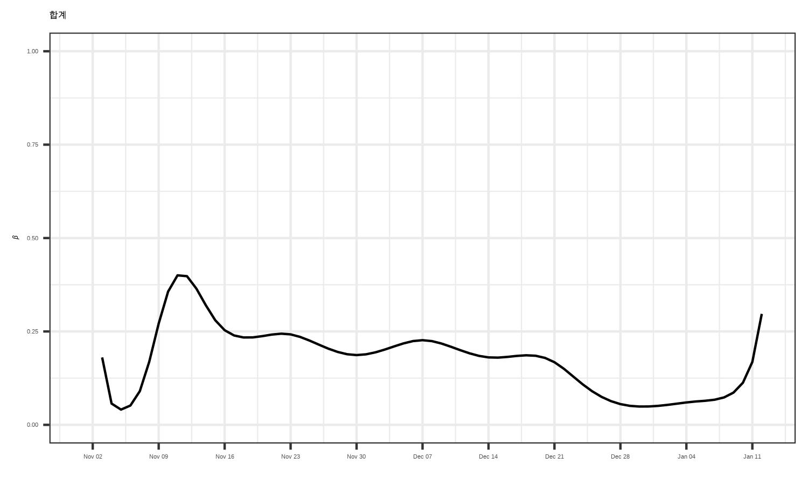
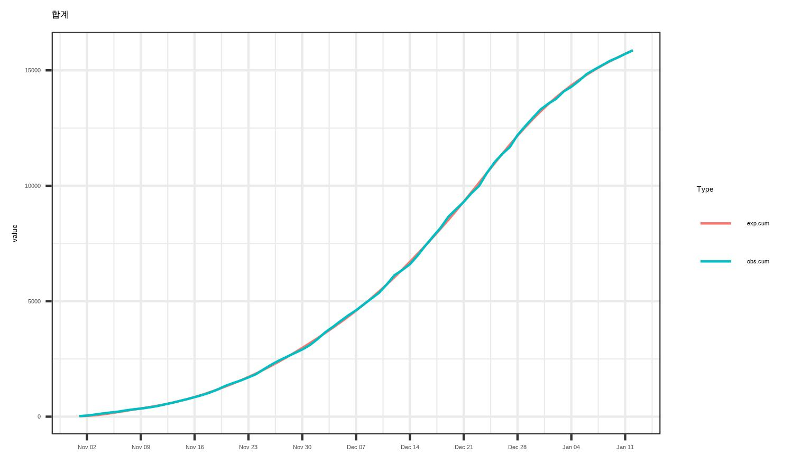
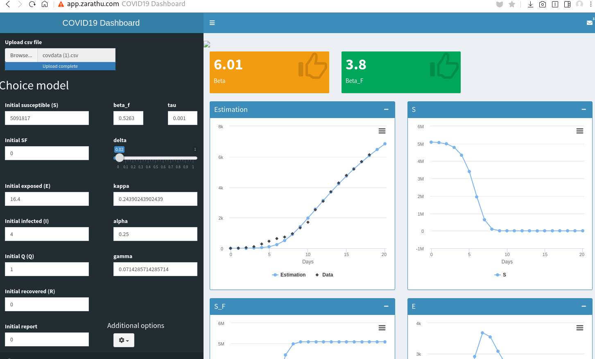

```{r setup, include=FALSE}
options(htmltools.dir.version = FALSE)
knitr::opts_chunk$set(echo = FALSE, fig.align = "center")
library(knitr);library(DT);library(shiny)
```


layout: true

<div class="my-footer"><span><a href="https://www.zarathu.com">Zarathu Co.,Ltd</a>   
&emsp;&emsp;&emsp;&emsp;&emsp;&emsp;&emsp;&emsp;&emsp;&emsp;&emsp;&emsp;&emsp;
&emsp;&emsp;&emsp;&emsp;&emsp;&emsp;&emsp;&emsp;&emsp;&emsp;&emsp;&emsp;&emsp;
<a href="https://github.com/jinseob2kim">김진섭</a></span></div> 


---

# Executive summary

.large[
- 대표적인 감염병 모형은 **SIR/SEIR** 이고, 초기값과 parameter(예: 접촉률)가 주어진 미분방정식으로 표현.


- 확진자수 등 **실제 데이터를 활용**, parameter 들을 추정.


- SEIR 에 서울시 확진자수를 적용, **시간에 따라 변화하는 접촉률**을 계산함.


- Parameter와 그 파생지표의 범위를 제한하고 신뢰구간을 계산하기 위해, **베이지안통계** 이용 예정. 
]

---
class: center, middle

# 감염병 수리모형 소개

---
# SIR model 


<center> </center>
<center> </center>

.large[
$N = S + I + R$ 은 보통 일정하다고 가정.
]

---
# $\beta$, $\gamma$

.large[
$\beta$: 감염률 
* 시간(일) 당 접촉수 $\times$ 접촉당 감염확률


$\gamma$: 회복률 

$$\frac{1}{\gamma}: \text{평균회복시간(일)}$$

감염재생산수 $R_0 = \frac{\beta}{\gamma}$
- $> 1$ 유행, $< 1$ 소멸
]

---
# [SEIR model](https://covid19.uclaml.org/model.html)

.large[
노출(Exposed) 후 **잠복기**를 거쳐 감염. $\frac{1}{\theta} = \text{잠복기간(일)}$

<center> </center>

$$
\begin{align}
      \frac{d S}{d t}&= -\frac{\beta I S}{N}\\
      \frac{d E}{d t}&= \frac{\beta I S}{N} -\theta E\\
      \frac{d I}{d t}&= \theta E - \gamma I\\
      \frac{d R}{d t}&=\gamma I
\end{align}
$$
]

---
# Simulation
.large[
https://benbennben.github.io/covid-19/

- 미분방정식(사실은 점화식) 은 초기값($S, I, R$), parameter($\beta$, $\gamma$)가 정해지면 단순계산으로 구할 수 있다.

- 그럼 끝?

]

--

.large[
- Parameter 를 어떻게 결정하나. 알아서 결정 vs **실제 데이터로 fitting**

- 서울시분석: 회복기간($\frac{1}{\gamma}$) 6.8일, 잠재기($\frac{1}{\theta}$) 3.5 일 가정, $\beta$ 는 추정.
]


---
# 보도자료 

https://www.nrc.re.kr/board.es?mid=a10301000000&bid=0008&list_no=171543&act=view&nPage=1&otp_id=


---
# 추정 과정 

.large[
1. 서울시 확진자 수, 인구수 정보 
- http://data.seoul.go.kr/dataList/OA-20279/S/1/datasetView.do

2. SEIR 모델: $\beta$ 만 추정($\gamma$, $\theta$ 고정)


3. $\beta$ 시간에 따라 변한다고 가정. 
- B-Spline Basis For Polynomial Splines 이용: 여러 3차함수 조합
- Basis 함수 갯수만큼 parameter 존재 
 
4. 최소제곱 or 포아송분포: 실제 확진자수를 가장 잘 맞추는 $\beta$ 선택 
]

---
# [Data](http://data.seoul.go.kr/dataList/OA-20279/S/1/datasetView.do)

```{r}
library(data.table)
info.sl <- fread("datasl_utf8.csv")[, `확진일` := lubridate::ymd(`확진일`)]

info.n <- fread("report.txt")[-c(1, 2), c(2, 4)][, `인구` := as.integer(gsub(",", "", `인구`))][]
for (v in info.n[["자치구"]][-1]){
  info.sl[["지역"]][grep(v, info.sl[["지역"]])] <- v
}
rmarkdown::paged_table(head(info.sl, 100))
```


---
# 확진자 수 

.large[
앞 데이터 이용
]
```{r}
inci <- rbind(info.sl[, .(`지역` = "합계", .N), by = "확진일"],
              info.sl[`지역` %in% info.n[["자치구"]][-1], .N, by = c("확진일", "지역")]
              )[order(`지역`, `확진일`)]
rmarkdown::paged_table(head(inci, 100))
```

---
# 인구수
```{r}
rmarkdown::paged_table(head(info.n, 26))
```


---
# SEIR model 

```{r, echo=T, eval = T}
incidata <- inci[지역 == "합계"]
times   <- seq(0, nrow(incidata) - 1, by = 1)
tt <- seq(min(times), max(times), len = max(times) +1)
B  <- splines::bs(tt, knots = seq(min(times), max(times), len = ceiling(nrow(incidata)/7)), Boundary.knots = c(min(times), max(times)+1), degree = 3)  #<<
  
  
covODE <- function(time, state, modelparams) {
    with(as.list(c(state, modelparams)), {
      ## modelparams 1, 2: theta, gamma
      beta <- exp(predict(B, time) %*% modelparams[-c(1, 2)]) #<<
      N <- S + E + I + R
      dS <- -beta*S*I/N 
      dE <- beta*S*I/N - theta*E
      dI <- theta*E - gamma*I
      dR <- gamma*I
      return(list(c(dS, dE, dI, dR)))
    })
  }


```

---

```{r, fig.width=10, fig.cap="B-splines of degree 3"}
matplot(tt,B,type="l")
```

---
# 오차함수 

```{r, echo=T, eval=F}
## Least square: x- basis parameter
ftemp <- function(x) {
  modelparams <- c(c(theta = 1/3.5, gamma = 1/6.8), x)
  tempoutput <- as.data.frame(ode(y = c(S = 9953009 - 1 - 1, E = 1, I = 1, R = 0), times = times, func = covODE, parms = modelparams))
  return(abs(tempoutput$R - cumsum(incidata$N)))
  }


## Poisson likelihood
ftemp2 <- function(x) {
  modelparams <- c(c(theta = 1/3.5, gamma = 1/6.8), x)
  tempoutput <- as.data.frame(ode(y = c(S = 9953009 - 1 - 1, E = 1, I = 1, R = 0), times = times, func = covODE, parms = modelparams))
  llik <- -sum(dpois(incidata, lambda = c(tempoutput$R[1], diff(tempoutput$R)), log = TRUE)) 
  return(llik)
}
```

---
# Estimation

```{r, echo=T, eval=F}
# Estimation
initbeta <- rep(0, ncol(B))                                 ## initial parameter
fitresult <- pracma::lsqnonlin(ftemp, initbeta)             ## nonlinear least square fit
#fitresult <- optim(initbeta, ftemp2, method = "L-BFGS-B")  ## poisson fit
betas <- fitresult[[1]]     
```

---
# 확진자수 예측

.large[
구한 $\beta$ 들의 basis parameter 이용 

```{r, echo=T, eval=F}
params = c(c(theta = 1/3.5, gamma = 1/6.8), betas)
output <- ode(y = c(S = 9953009 - 1 - 1, E = 1, I = 1, R = 0), times = times, func = covODE, parms = params)
```

코드는 https://github.com/jinseob2kim/covidmodel-seoul/tree/main/docs/modelling/sources 에
- 11월부터, 시군구별 분석 수행
]

---
# $\beta$ 추정



---
# 누적 확진수 예측


---
# 보완점
.large[
- $\beta$, 예측값의 신뢰구간 구하기가 어려움. 

-  여러 지표들의 신뢰구간을 자유자재로 구하기 위해 MCMC 등을 이용한 베이지안통계 필요. R에서 [stan](https://mc-stan.org/users/documentation/case-studies/boarding_school_case_study.html) 이용가능.

- 일부 데이터만 이용시(예: 11월 이후) 초기조건 정하기 어려움.
]

---
# ShinyApps

[](http://app.zarathu.com/konkukmath/covid19/)


---

# Executive summary

.large[
- 대표적인 감염병 모형은 **SIR/SEIR** 이고, 초기값과 parameter(예: 접촉률)가 주어진 미분방정식으로 표현.


- 확진자수 등 **실제 데이터를 활용**, parameter 들을 추정.


- SEIR 에 서울시 확진자수를 적용, **시간에 따라 변화하는 접촉률**을 계산함.


- Parameter와 그 파생지표의 범위를 제한하고 신뢰구간을 계산하기 위해, **베이지안통계** 이용 예정. 
]

---

class: center, middle

# END
